# BIRLA INSTITUTE OF TECHNOLOGY, MESRA, RANCHI 

 

# MEASURES OF VARIABILITY &amp; DISPERSION

**Submitted to:** Rashmi Rathi Upadhyay 

**Submitted by:** 

**Name:** Kumar Govinda 

**Roll No.:** MCA/10005/18 

**Semester:** IV 

**Subject:** Massive Online Courses and Assignments 

# **Dispersion** 

Dispersion means the amount of discrepancies among the data entries. It is used to compare dispersion of various samples. Reliability of measure of central tendency. 

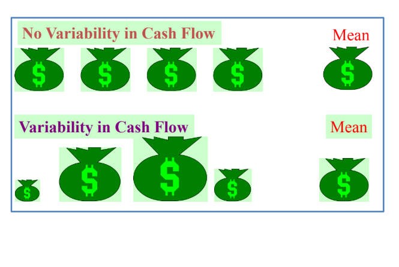 

Fig: Dispersion 

There are several ways to measure dispersion in a data set and these are: 

- Range
- Inter-quartile range
- Mean absolute deviation
- Variance
- Standard deviation
- Skewness
- Kurtosis

Range (for ungrouped data)

- The difference between the largest and the smallest values in a set of data.
- It is simple to compute.
- It ignores all data points except the two extremes.
- Given a set of data set, the range is defined as the interval (min, max). Hence the range length (RL) is the difference between the maximum and the minimum of the data entries (i.e., RL=max-min).

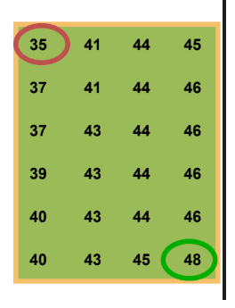 

Fig: Range

Range = Largest – Smallest = 48 – 35 = 13 

Algorithm for range:

1. The set of numbers are taken in an array.
2. 2 variables are taken one for minimum number (min) and second for maximum number (max).
3. Both the variable points to the same index.
4. Compare the rest numbers with the 2 variables till end.
5. Update the numbers
  1. If num\&gt;max, update max with num
  2. If num\&lt;min, update min with num
6. The difference of max and min is stored in another variable range.

Range-\&gt; max-min

Real life example: 

- Weather forecast
- Quality control
- Fluctuation in share prices

Inter-quartile Range 

- The inter-quartile range tells us the spread of the middle 50% of the data (roughly speaking, the middle class of the individuals sampled).
- Quartiles: There are 3 quartiles (1st, 2nd, and 3rd) for a data set that divide the data set into four quarters. Median of a data set divides the data set into 2 halves and it is also called the second quartile Q2. First quartile (25th percentile) Q1 is the median of the lower half of the data, and the third quartile (75th percentile) Q3 is the median of the upper half of the data.
- IQR is defined as the difference between first and third quartile
- Range of the middle halves.
- Less influenced by extremes.
- IQR=Q3-Q1

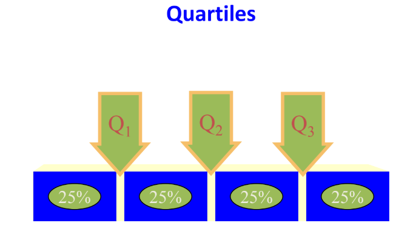 

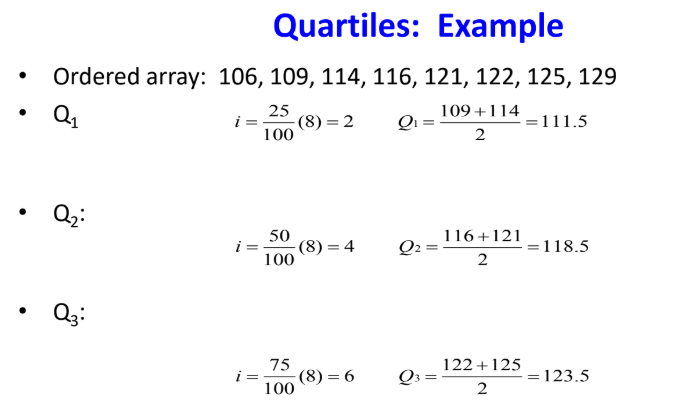 

IQR=Q3-Q1 

IQR=123.5-111.5=12 

Algorithm for IQR: 

1. Start
2. The array is sorted in ascending order.
3. 4 variables are initialized Q1, Q2, Q3, IQR
4. Q2 is same as the median.
5. Q1 and Q2 are then divided into 2 halves of the data set and the median of the both the halves are calculated.
6. IQR-\&gt;Q3-Q1

Real Life example of IQR: 

- Can be used in weather forecasting
- Its data can be used while creating a box plot.

Mean Absolute Deviation 

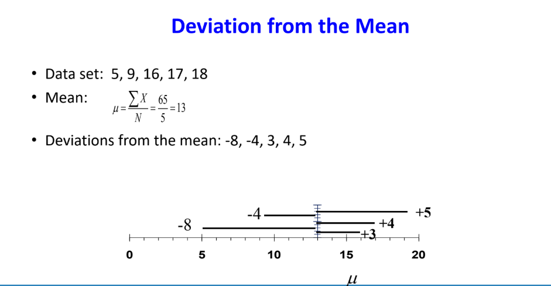 

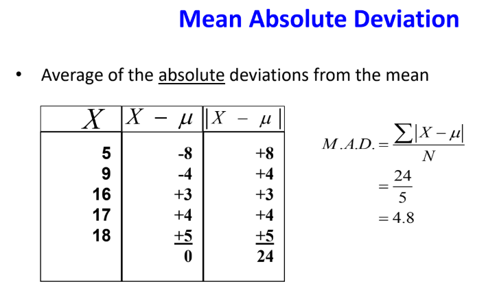 

Algorithm of deviation from the mean 

1. Start
2. Store the data set in a array
3. Initialize sum=0
4. Sum-\&gt;sum + each element in the array
5. Repeat step 4 until all the elements are added.
6. Mean-\&gt;sum/(No. of elements)
7. Array-\&gt;Mean – (each element)
8. Repeat step 7 until all elements are subtracted and added in the array

Algorithm for Mean Absolute Deviation 

1. Start
2. |Array| // absolute value of the array is taken i.e. obtained from deviation from mean
3. Initialize sum=0
4. Sum = sum + array //repeat until all the elements are not added to the sum
5. Initialize MAD; MAD = sum/(no. of elements)

Standard Deviation 

- This concept was introduced by Karl Pearson in 1893.
- It by far the most important and widely used measure of studying variation.
- It is the measure of how much &quot;spread&quot; or &quot;variability&quot; is present in the sample if all the numbers in the sample are very close to each other, the standard deviation will tend to be large.
- It is also known as root mean square deviation for the reason that it is the square root of the means of square deviations from the arithmetic mean.
- It is denoted by

 

-

- Standard deviation can be indicator of financial risk

- Quality Control
- Construction of quality control effects process capability studies
- Comparing populations
- Households incomes in two cities
- Employee absenteeism at two plants 

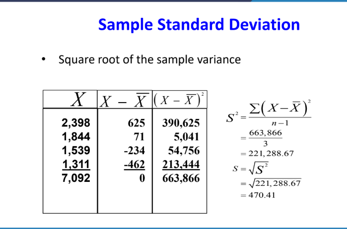 

Algorithm for Standard deviation

1. Start
2. The raw data is stored in the array
3. Mean is calculated by adding all the numbers of raw data and dividing the sum by the no. of observations.
4. Subtract the mean from each value of the array and store its absolute value in the new array and also square each value obtained.
5. Add all the values stored in the new array.
6. Divide the obtained sum by the total number of observations.
7. The result obtained in step 6 is square rooted
8. The square rooted value is the required standard deviation.

Real life example of Standard deviation 

- In real life, it is quite possible to have two sets of observations with the same mean (average) but still differ considerably in their measurements about the average. Standard deviation is the measure of spreading of numerical data about an average. Standard Deviation of a given set of observations is defined as the positive square root of the arithmetic mean of the squares of deviations of the observations from their arithmetic mean. It is an absolute measure of dispersion. It depends upon the unit of measurement.

## Variance 

- The average of the squared differences from the mean.
- It is the measurement of the spread between numbers in a data set.
- That is, it measures how far each number in the set is from the mean and therefore from every other number in the set.

 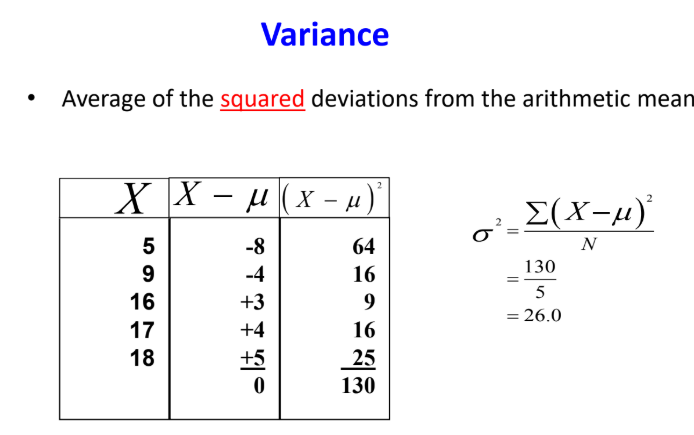 

Algorithm for the variance

1. Start
2. The steps are same as it was in standard deviation.
3. Only the result obtained from standard deviation is squared
4. The squared number is the variance.

Real life example of variance

-  A manufacturing machine fills up water bottles with 8oz. Now the machine does not fill up each water bottle with exactly 8oz, there is a little variation due environmental factors (weather, placement of bottle, etc.). This variation is example of variance or standard deviation.

## Skewness 

- The term &#39;skewness&#39; refers to lack of symmetry or departure from symmetry, eg., when a distribution is not symmetrical (or is asymmetrical) it is called skewed distribution.
- The measures of skewness indicate the difference between the manner in which the observations are distributed in a particular distribution compared with a symmetrical (or normal) distribution.
- The concept of skewness gains importance from the fact that statistical theory is often based upon the assumption of the normal distribution.
- A measure of skewness is, therefore, necessary in order to guard against the consequences of this assumption.

 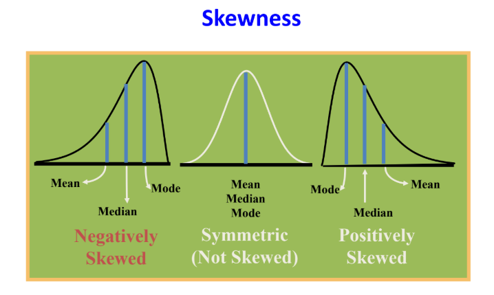 

Fig: Skewness 

- The skewness of a distribution is measured by comparing the relative positions of the mean, median and mode.
- Distribution is symmetrical
  - Mean = median = mode
- Distribution is skewed right
  - Median lies between mode and mean, and mode is less than mean
- Distribution skewed left
  - Median lies between mode and mean, and mode is greater than mean.
- Coefficient of skewness

 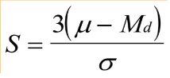 

  - If S\&lt;0, the distribution is negatively skewed (skewed to the left)
  - If S=0, the distribution is symmetric (not skewed)
  - If S\&gt;0, the distribution is positively skewed (skewed to the right)
- Skewness can be used to obtain approximate probabilities and quantities of distributions (such as value at risk in finance) via the Cornish-Fisher expansion.
- Many models assume normal distribution, i.e., data are symmetric about the mean. The normal distribution has a skewness of zero.
 
Algorithm for Skewness:

1. Start // for calculating the skewness, we require mean, median and standard deviation
2. Calculating the mean from the given set of data
  1. Sum of all the data of the list is calculated and and divided by the no. of data in the list.
3. Calculate the median from the given set of data
  1. Arrange all the data set in ascending order
  2. Find out the midterm, median-\&gt;(total no. of terms+1)/2
    1. If a whole no. is generated then the number present in that position is the median
    2. If a fraction is generated then the whole number of the fraction and the next number is taken and the numbers present at that position is obtained and both of them are summed and divided by 2, the obtained number is the median.
4. Calculate the standard deviation
  1. Mean is calculated by adding all the numbers of raw data and dividing the sum by the no. of observations.
  2. Subtract the mean from each value of the array and store its absolute value in the new array and also square each value obtained.
  3. Add all the values stored in the new array.
  4. Divide the obtained sum by the total number of observations.
  5. The result obtained in step d is square rooted
  6. The square rooted value is the required standard deviation.
5. Difference of the mean and median is multiplied by 3.
6. The result obtained in step 5 is then divided by standard deviation.
7. The result obtained in step 6 is the skewness and according to its value categorize it into positive, negative and symmetric.

## Kurtosis 

- In describing a frequency distribution, a person can use an average to show the typical value or central tendency in the distribution, a measure of variation to show the variation of values either with certain values (such as range and quartile deviation) or around the average of the distribution (such as the average deviation and the standard distribution) either skewed to the higher values (the right side of the X-scale) or the lower values (the left side of the X-scale).
- Kurtosis refers to the degree of the flatness or peakedness in the region about the model of a frequency curve.
  - Leptokurtic : high and thin
  - Mesokurtic : normal in shape
  - Platykurtic : flat and spread out

 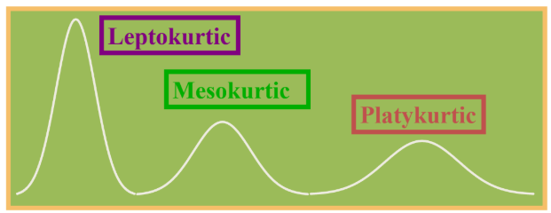 

- Formula of kurtosis is 

β2=μ4/μ22 

  - If the value of β2 is greater than 3, the curve is more peaked than the normal curve, i.e., leptokurtic.
  - When the value is less than 3, then the curve is less peaked than normal curve i.e., platykurtic.

Algorithm for kurtosis 

For calculating kurtosis, we have to first find out the moment of the data about the mean, μ1, μ2, μ3, μ4 up to moment μr.

- Algorithm for calculating moment 
  - Start
  - Mean is calculated of the raw data given
    - Sum of all the data of the list is calculated and divided by the no. of data in the list.
  - The mean is subtracted from the set of numbers and the obtained number is raised to the power r, where r is the rth moment, and is stored in an array.
  - The sum of the numbers is taken out and is divided by the total number of observations.

1. Start
2. For kurtosis we have to calculate the forth and the second moment
3. The value of the second moment is squared.
4. Value of fourth moment and the squared value of the second moment are divided.
5. The result obtained gives the value of kurtosis.

Real life example of kurtosis 

- The sample kurtosis is a useful measure of whether there is a problem with outliers in a data set. Larger kurtosis indicates a more serious outlier problem, and may lead the researcher to choose alternative statistical methods.
